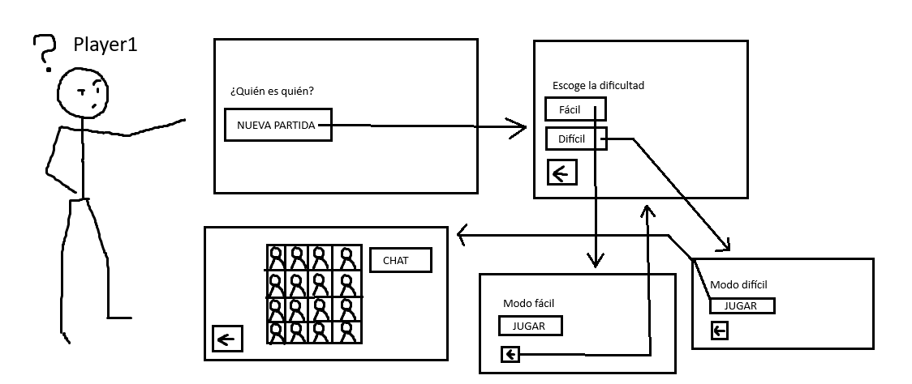
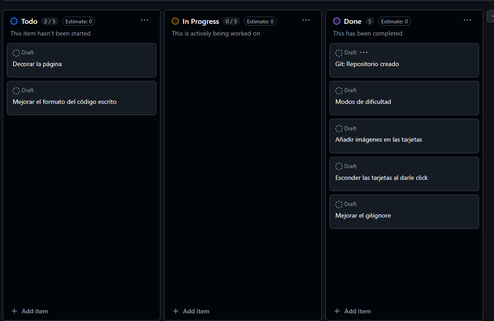
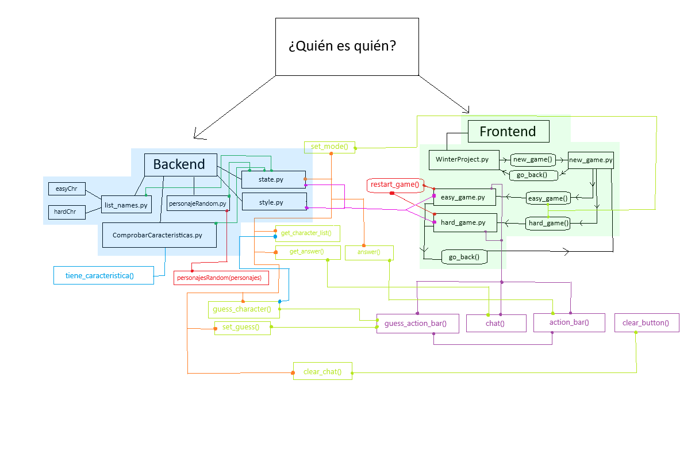
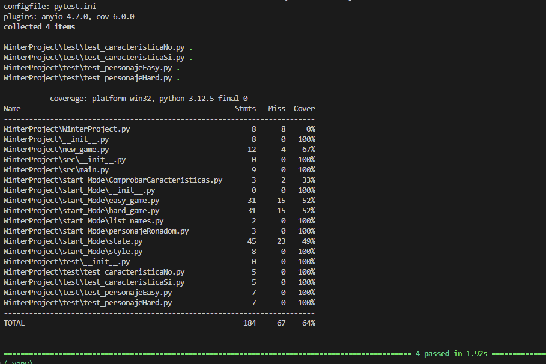
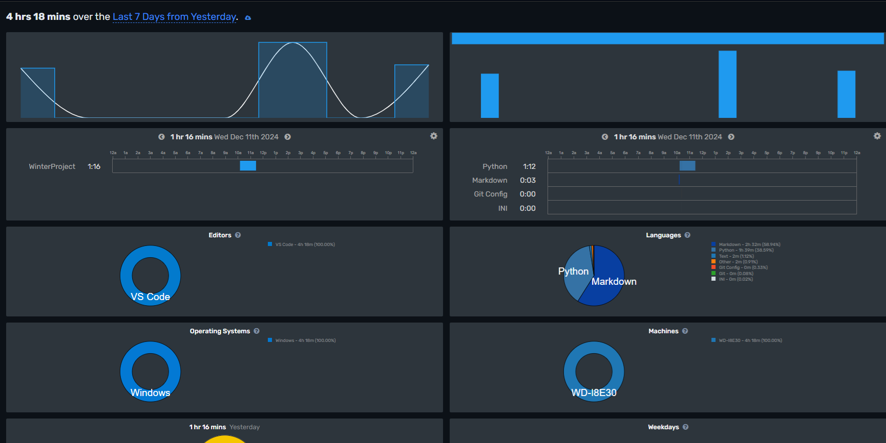
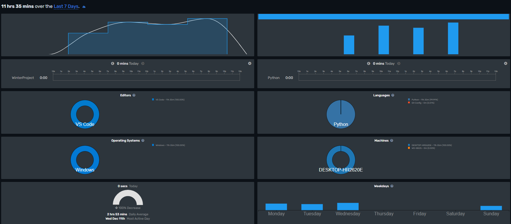

<p aling="center">
    
</p>

<hr>

# **Winter Project - [¿Quién es quién?](https://es.wikipedia.org/wiki/Guess_Who%3F) Version 1.0.0**

**Tabla de contenidos**

-   [**Introducción**](#introducción)
-   [**Manual**](#manual)
    -   [**Pre-requisitos**](#pre-requisitos)
    -   [**Instalación**](#instalación)
    -   [**Uso**](#uso)
-   [**Metodología**](#metodología)
-   [**Descripción técnica**](#descripción-técnica)
    -   [**Requisitos funcionales/no funcionales, NOT LIST**](#partes-interesadas-y-requisitos-funcionalesno-funcionales)
    -   [**Historias de usuario**](#historias-de-usuario)
    -   [**Arquitectura de la aplicación**](#arquitectura-de-la-aplicación)
-   [**Diseño**](#diseño)
    -   [**Diagrama de Componentes**](#componentes)
-   [**Implementacion**](#implementacion)
    -   [**Tecnologías y Herramientas utilizadas**](#tecnologías-y-herramientas-elegidas)
    -   [**Backend**](#backend)
    -   [**Frontend**](#frontend)
-   [**Pruebas**](#pruebas)
    -   [**Coverage**](#coverage)
    -   [**Test de unidad**](#test-de-unidad)
    -   [**Test de integración**](#test-de-integración)
-   [**Análisis del tiempo invertido**](#Tiempo-invertido)
    -   [**Clockify + Wakatime**](#clockify)
    -   [**Justificación temporal**](#justificación-temporal)
-   [**Conclusiones**](#conclusiones)
    -   [**Posibles mejoras**](#posibles-mejoras)
    -   [**Dificultades**](#dificultades)

# **Introducción**
Proyecto de 1ºDAM hecho por Luis Miguel y Juan Pablo. 
Junto a otros compañeros del ciclo, tuvimos que crear un ¿Quién es quién? con el Framework Open source de **[Reflex](https://reflex.dev/)**.
Este último fue escogido por nuestro Product Owner debido a que con Reflex podemos crear páginas web fácilmente con Python.

# **Manual**
## **Pre-requisitos**
-   `Git`
-   `Python3`
-   `pip3`
-   `reflex`
-   `pillow (PIL)`
-   `pytest`
-   `coverage`

## **Instalación**
Para poder instalar este repositorio y acceder al juego, debemos primero crear la carpeta donde guardaremos el repo mediante:
```
mkdir ./nombre_app
cd ./nombre_app
```

Luego, debemos clonar el repositorio de GitHub
```
git clone https://github.com/treboL-uismi/WinterProject
```

Siguiente paso, debemos instalar un entorno virtual mediante esta otra cadena de comandos,

**Versión Linux**
```
python3 -m venv .venv
source .venv/bin/activate
```
**Versión Windows**
```
py -3 -m venv .venv
.venv\\Scripts\\activate
```

Por último, instalaremos las dependencias necesarias para poder acceder a la interfaz gráfica,
```
pip3 install -r requirements.txt
```

Si quisieramos iniciar la aplicación, tendríamos que hacer un ```reflex run```.
## Uso
**1. Esperar a que termine de compilar el programa y meterse a la página que te envía.**

**2. Entrar a una nueva partida y seleccionar el modo de juego.**

**3. Enjoy the ride!**

# **Metodología**
En general, para las partes del Frontend y Backend del proyecto, lo que hicimos fue replicar otros ejemplos que ya estaban hechos en los Docs de Reflex.
Para las imagenes en el Frontend, a Luismi se le ocurrió un método que consiste en segmentar la imagen completa en distintas coordenadas para poder optimizar el uso de esta en cada tarjeta.

# **Descripción Técnica**
La aplicación basada en el Framework de Reflex, está obviamente inspirada en el juego de ¿Quién es quién?
Añade 2 modos de dificultad, el modo fácil y el difícil. Cada dificultad contiene diferentes cantidades de cartas o personajes, Modo Fácil (8), Modo Difícil (16).
## **Requisitos funcionales/no funcionales, NOT LIST**
Requisistos funcionales: Jugar a una partida en modo fácil o difícil.

Requisitos no funcionales: Escoger aleatoriamente a un personaje, comprobar las características de un personaje...

IN SCOPE: Arquitectura del proyecto, las tarjetas, imágenes, el chat...

OUT SCOPE: Imágenes en cada página (decorarla al gusto visual), 

UNRESOLVED: Añadir un historial de partidas

## **Diagrama de casos de uso**


## **Historias de usuario**


## **Arquitectura de la aplicación**
Proyecto dividido en varias carpetas:

*Miscelanea*
- **/assets** : Ubicación de las imágenes necesarias,
- **/requirements.txt** : Ubicación de las dependencias,
- **/rxconfig.py** : Ubicación de la configuración de Reflex,
- **/pytest.ini** : Ubicación de los marks de pytest.

*Backend*
- **/back/test** : Ubicación de los casos test,
- **/WinterProject/start_Mode/list_names.py** : Ubicación de las características de todos los personajes,
- **/WinterProject/start_Mode/personajeRonadom.py** : Script de generación de personaje al azar,
- **/WinterProject/start_Mode/ComprobarCaracteristicas.py** : Script de comprobación de las características de cada personaje escogido.

*Frontend*
- **/WinterProject** : Carpeta fundamental para el funcionamiento de las páginas y su lógica,
- **/WinterProject/WinterProject.py** : Página que funciona como el "index",
- **/WinterProject/new_game.py** : Página que sirve para escoger los 2 modos de dificultad,
- **/WinterProject/start_Mode/easy_game.py** : La partida en dificultad fácil,
- **/WinterProject/start_Mode/hard_game.py** : La partida en dificultad difícil.

# **Diseño**
## **Diagrama de Componentes**

# **Implementación**
## **Tecnologías y Herramientas Elegidas**
- [Reflex](https://reflex.dev/)
    - Framework escogido por nuestro Product Owner (nuestro profesor) para poder realizar el proyecto.
- [Python](https://www.python.org/)
    - [PIL](https://pypi.org/project/pillow/)
        - Librería escogida por Luismi para realizar un mapeado de imágenes con las tarjetas.
    - [Pytest](https://docs.pytest.org/en/stable/) + [Coverage](https://coverage.readthedocs.io/en/7.6.8/)
        - Librerías necesarias para realizar los casos test.

## **Backend**
Toda la lógica está guardada en la carpeta **/back**, dentro de ella encontraremos **/src** y **/test**.
Dentro de **/src** podemos encontrar el algoritmo principal para escoger al personaje aleatorio y el reconocimiento de características de cada personaje.
Dentro de **/test** encontramos los casos test.
## **Frontend**
Podemos encontrar la distribución de las páginas de Reflex dentro de la carpeta **/WinterProject**.
Dentro de esta hallamos **WinterProject.py**, siendo este la página principal del proyecto. Además tenemos a **new_game.py**, esta es la página de nueva partida.
Dentro de la carpeta hallamos otras dos carpetas, siendo **/game_modes** la ubicación de los modos de dificultad y **/start_Mode** la ubicación de los tableros.

# **Pruebas**
## **Coverage**



# **Análisis del tiempo invertido**
## **Wakatime**


## **Justificación temporal**
Es obvio que faltan capturas de Wakatime y esto no representa todo el tiempo invertido en el proyecto, nosotros estimamos que hemos trabajado cada uno unas 30 horas.

# **Conclusiones**
Cabe recalcar que aún faltan cosas por implementar en este proyecto pero podemos presenciar novedades como los 2 modos de dificultad.

En general ha sido una experiencia interesante.
## **Posibles mejoras**
En un futuro mejoraremos el estilo del Frontend para que pueda ser mucho más aceptable visualmente, optimizar a lo mejor la lógica detrás del juego e implementar branches de Git Flow (hotfix, release...)
## **Dificultades**
En general nuestro mayor problema fueron las imagenes a la hora de ocultarlas al darle click en cada una.

Mención honorable a los casos test.